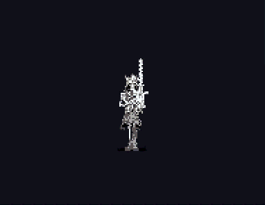
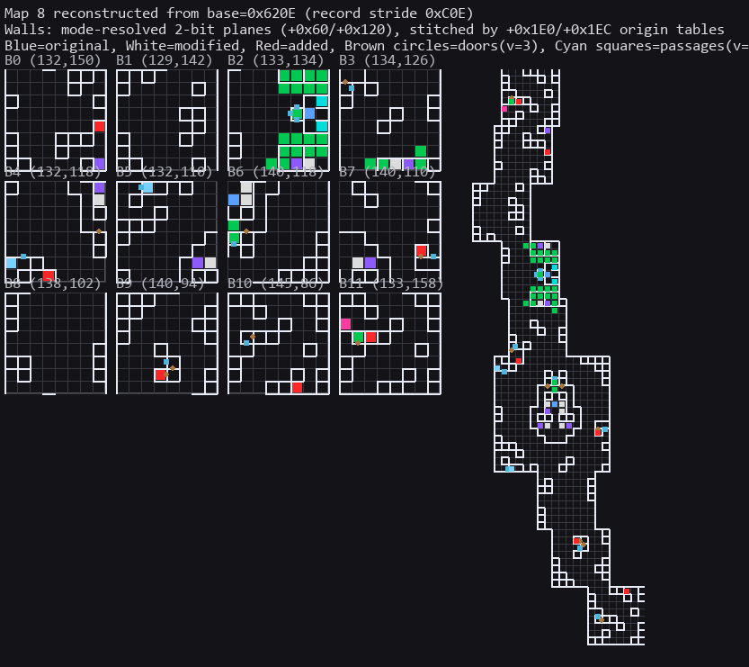
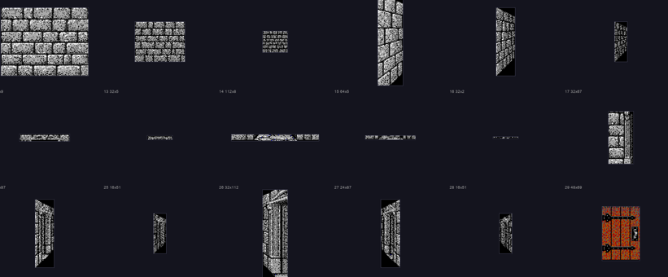
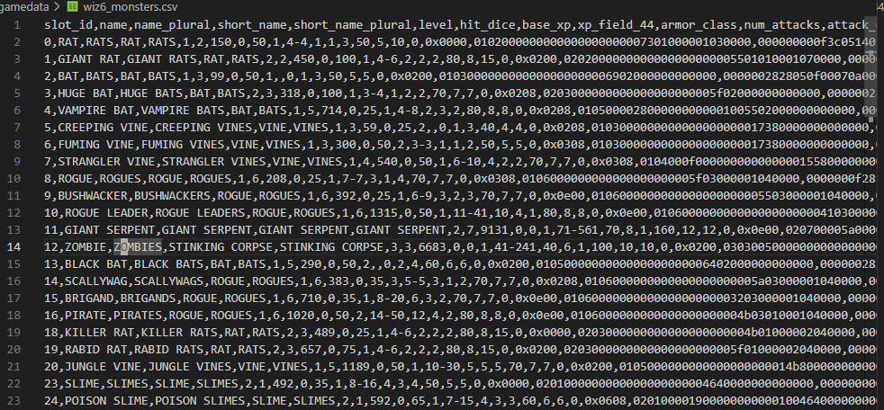
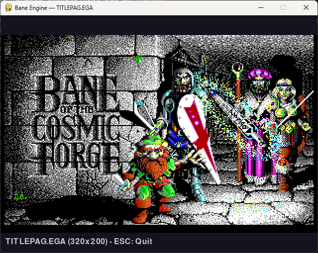
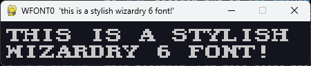
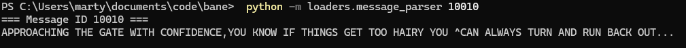

# Wizardry 6: Bane of the Cosmic Forge reverse engineering adventures

This repo is an attempt to reverse engineer as much of Wizardy 6 as possible.
There have been a number of previous reverse engineering efforts such as [Cosmic Forge](https://spershin.wixsite.com/mad-god-tiny-hut/cosmic-forge) editor and various save game modification tools such as baneedit, but they are closed source and the file formats remain largely undocumented. 

Let's see if we can change that!

### File format docs
Most up to date file format docs are stored in [file_format_docs](file_format_docs/)

### Examples
Here are some things that are kind of working. They assume that you have the original game data in a `gamedata/` folder.

#### Monster graphics:
`python -m loaders.pic_viewer .\gamedata\mon25.PIC`

#### Map parsing:
`python .\loaders/render_map_walls_reconstructed.py --map-id 8`

#### Wall textures:
`python  .\loaders\extract_mazedata_tiles.py`

#### Items, Monsters, XP tables:
`python .\loaders\scenario_viewer.py .\gamedata\scenario.dbs`

#### Screen viewers:
`python loaders/ega_viewer.py .\gamedata\TITLEPAG.EGA`

#### Character portraits:
`python -m loaders.pic_viewer .\gamedata\WPORT1.EGA`

#### Fonts:
`python -m loaders.render_font "this is a stylish wizardry 6 font!" --max-width 150`

#### Messages:
 `python -m loaders.message_parser 10010`
 

# Usage of AI tools
This repo uses many AI tools including Codex, Claude, and Gemini. LLMs are extremely effective reverse engineering tools in many different ways, including:
 - Binary disassembly and logic analysis
 - Binary pattern recognition and searching
 - Correlating local reverse engineered information with information found online
 - writing throwaway code for quick iteration and testing of many possibilities
